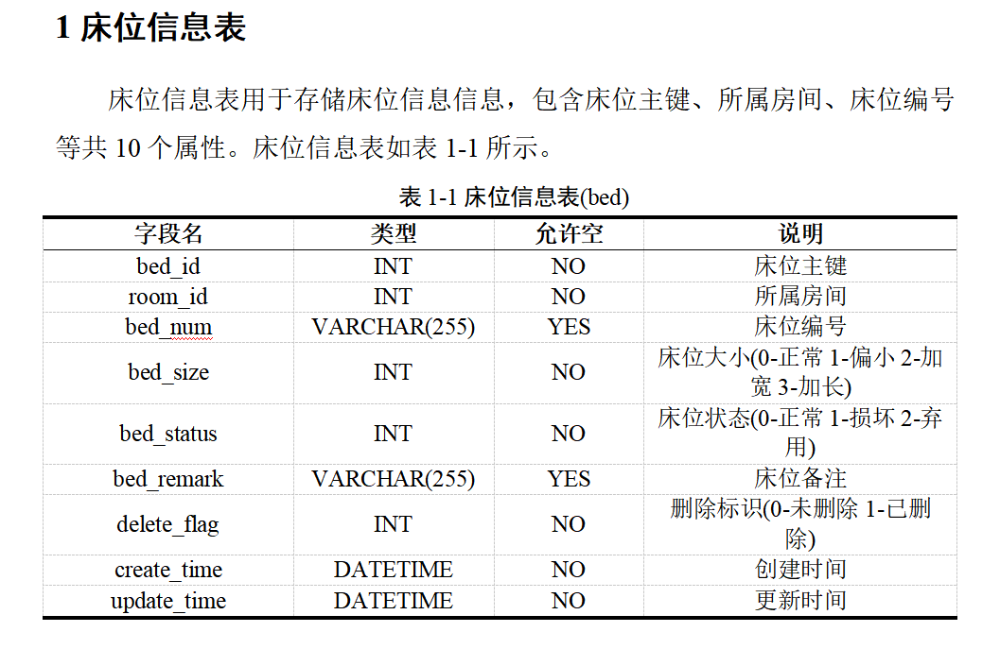

# Sql2Doc - SQL表结构转Word文档生成器（SQL2Doc Generator）

Sql2Doc是一个强大的Python工具，用于将SQL数据库表结构（CREATE
TABLE语句）自动转换为格式规范的Word文档。它支持MySQL语法，能够提取表名、字段信息、注释等内容，并生成专业美观的数据库设计文档。

## 主要功能

- 🚀 自动解析SQL文件中的CREATE TABLE语句
- 📊 提取表名、字段名、数据类型、允许空值和注释
- ✨ 生成格式规范的Word文档，包含表格和说明文字
- 🎨 高度可定制化的样式配置（字体、颜色、对齐方式等）
- 📐 支持三线表和全线表两种表格样式
- 📌 自动编号和交叉引用（表编号、章节编号）

---

## 使用方法

### 下载项目

```bash
git clone https://github.com/z-zero-l/Sql2Doc.git
cd sql2doc
```

### 安装三方库

```bash
pip install python-docx
```

### 输入SQL语句

`input.sql`

### 修改配置样式

#### 1. 默认文本样式配置项（default_style）

| 配置项                 | 说明   | 默认值               |
|---------------------|------|-------------------|
| `font`              | 英文字体 | `Times New Roman` |
| `font-CN`           | 中文字体 | `宋体`              |
| `size`              | 文本大小 | `12 - 小四`         |
| `color`             | 文本颜色 | `黑色`              |
| `align`             | 对齐方式 | `LEFT - 左对齐`      |
| `line_spacing-CN`   | 行间距  | `Pt(22) - 固定值22磅` |
| `space_before`      | 文本前  | `0`               |
| `space_after`       | 文本后  | `0`               |
| `first_line_indent` | 首行缩进 | `0`               |

#### 2. 章节标题样式配置项（head_style）

| 配置项     | 说明     | 默认值                |
|---------|--------|--------------------|
| `add`   | 是否添加此项 | `True`             |
| `style` | 样式信息   | `一级标题 黑体小三 1.5倍行距` |

#### 3. 内容段落样式配置项（content_style）

| 配置项     | 说明     | 默认值       |
|---------|--------|-----------|
| `add`   | 是否添加此项 | `True`    |
| `style` | 样式信息   | `首行缩进2字符` |

#### 4. 表格标题样式配置项（title_style）

| 配置项     | 说明     | 默认值      |
|---------|--------|----------|
| `add`   | 是否添加此项 | `True`   |
| `style` | 样式信息   | `黑体五号居中` |

#### 5. 表格样式配置项（table_style）

| 配置项          | 说明     | 默认值     |
|--------------|--------|---------|
| `add`        | 是否添加此项 | `True`  |
| `table_type` | 表格样式类型 | `1-三线表` |

#### 6. 文本样式配置项（basic_num）

| 配置项               | 说明         | 默认值     |
|-------------------|------------|---------|
| `blank`           | 章节间是否空行    | `False` |
| `chapter_num`     | 章节编号       | `1`     |
| `start_table_num` | 起始表格编号     | `1`     |
| `attribute_num`   | 内容中显示的属性数量 | `3`     |

### 运行文件

`SqlToWord`

---

## 查看输出结果

`output.docx`

### 输出示例



---

## 贡献

欢迎贡献代码和提出改进建议！请遵循以下步骤：

1. Fork项目
2. 创建新分支 (`git checkout -b feature/your-feature`)
3. 提交更改 (`git commit -am 'Add some feature'`)
4. 推送到分支 (`git push origin feature/your-feature`)
5. 创建Pull Request

---

## 许可证

本项目采用[GNU General Public License v3.0]()

---

**Sql2Doc**- 让数据库文档生成变得简单高效！